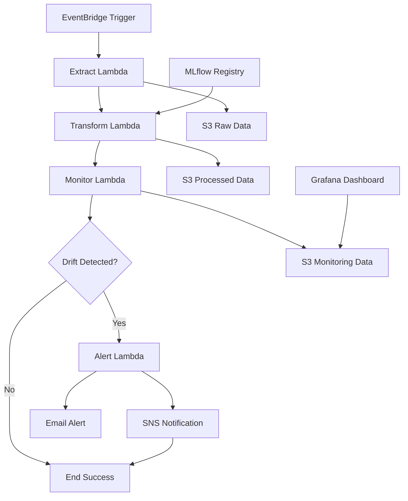
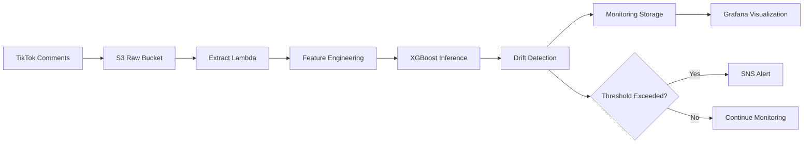

# 🚀 ABSA-Drift — Production ML Drift Detection Pipeline


Real-time sentiment analysis model drift detection for **TikTok comment data** using serverless AWS architecture with **XGBoost**, **MLflow**, and **Evidently AI** monitoring.

## 📋 Table of Contents
- [Problem Description](#problem-description)  
- [System Architecture](#system-architecture)
- [Quick Start](#quick-start-local-development)
- [Pipeline Components](#pipeline-components)
- [Data Flow](#data-flow-transformation)
- [Monitoring](#monitoring-grafana-dashboards)
- [Deployment](#deployment-infrastructure)
- [Technologies](#core-technologies)

---

## ❓ Problem Description

Social media sentiment shifts rapidly, causing **ML model drift** that goes undetected until significant business impact occurs. ABSA-Drift solves this by:

- **Real-time drift detection** using statistical tests (PSI, KS-test)
- **Automated alerting** via SNS when model performance degrades
- **Continuous monitoring** of sentiment analysis predictions on live TikTok data
- **Cost-effective serverless** architecture that scales with data volume

> *"This system implements an end-to-end ML monitoring pipeline that processes TikTok comment data through extraction, feature engineering, inference, and drift detection stages. The pipeline uses XGBoost multi-output regression for aspect-based sentiment analysis, comparing current predictions against baseline distributions using Evidently AI. When drift exceeds configurable thresholds, automated alerts are sent via SNS, enabling rapid response to model degradation before business impact occurs."*

## 🏗️ System Architecture

### Production Architecture
```
EventBridge (Hourly) → Step Functions State Machine
                              ↓
                     Extract Lambda (S3 → Parquet)
                              ↓  
                     Transform Lambda (ML Inference)
                              ↓
                     Monitor Lambda (Drift Detection)
                              ↓
                     Alert Lambda (SNS Notifications)
                              ↓
                     Grafana Dashboard (Monitoring)
```

### Local Development Architecture  
```
Docker Compose Stack:
├── LocalStack (AWS Mocks)
├── MinIO (S3 Storage) 
├── Airflow (Workflow Orchestration)
├── MLflow (Model Registry)
├── PostgreSQL (Data Storage)
├── Grafana (Monitoring)
└── MailHog (Email Testing)
```

**📸 Screenshot Placeholder:** *Architecture diagram showing data flow from TikTok comments through the entire pipeline*

---

## ⚙️ Prerequisites

- **Docker** and **Docker Compose**
- **Python 3.9+**
- **AWS CLI** (for production deployment)
- **LocalStack** (for local development)

---

## 🚀 Quick Start (Local Development)

### 1. Clone and Setup
```bash
# 1) Clone repository
git clone https://github.com/dvrk-dvys/ABSA-Drift
cd ABSA-Drift

# 2) Create environment file
cp .env.example .env
# Edit .env with your email for alerts

# 3) Start local development stack
docker-compose -f docker-compose.local.yml up -d

# 4) Wait for services to be ready
docker-compose logs -f mlflow
```

**📸 Screenshot Placeholder:** *Terminal showing docker-compose startup logs with all services healthy*

### 2. Access Local Services

**Local Development URLs:**
* **MLflow Tracking** → [http://localhost:5001](http://localhost:5001)
* **Grafana Dashboards** → [http://localhost:3000](http://localhost:3000) (admin/admin)
* **Airflow Pipeline** → [http://localhost:8080](http://localhost:8080) (admin/admin)
* **MinIO Console** → [http://localhost:9001](http://localhost:9001) (minioadmin/minioadmin)
* **MailHog (Email Testing)** → [http://localhost:8025](http://localhost:8025)

**📸 Screenshot Placeholder:** *MLflow UI showing registered models and experiment tracking*

---

## 🔄 Pipeline Components

### 1. Extract Lambda
**Purpose**: Data ingestion from S3 TikTok comment files
```python
# Processes recent uploads from S3
recent_files = get_recent_files(bucket='tiktok-comments', minutes=60)
processed_df = extract_and_validate(recent_files)
```

**📸 Screenshot Placeholder:** *CloudWatch logs showing successful data extraction with row counts*

### 2. Transform Lambda  
**Purpose**: ML inference using trained XGBoost models
```python
# Multi-output regression for ABSA
predictions = model.predict(features)
outputs = {
    'sentiment_score': predictions[:, 0],    # [-1, 1]
    'engagement_score': predictions[:, 1],   # [0, 1] 
    'implicitness_degree': predictions[:, 2] # [0, 1]
}
```

**📸 Screenshot Placeholder:** *MLflow model registry showing active model versions and metrics*

### 3. Monitor Lambda
**Purpose**: Statistical drift detection using Evidently AI
```python
# Population Stability Index calculation
psi_score = calculate_psi(current_data, baseline_data)
drift_detected = psi_score > threshold  # Default: 0.2
```

**📸 Screenshot Placeholder:** *Evidently AI drift report showing PSI scores and feature distributions*

### 4. Alert Lambda
**Purpose**: SNS notifications when drift exceeds thresholds
```python
# Intelligent alerting with severity levels
if psi_score > 0.3:
    send_alert(severity='CRITICAL', message=drift_summary)
elif psi_score > 0.2:
    send_alert(severity='WARNING', message=drift_summary)
```

**📸 Screenshot Placeholder:** *Email notification showing drift alert with actionable insights*

---

## 📊 Data Flow Transformation

### Input: TikTok Comments (CSV/Parquet)
```json
{
  "comment_text": "This product is amazing but the shipping was slow",
  "engagement_count": 156,
  "timestamp": "2025-01-15T14:30:00Z",
  "video_id": "7123456789",
  "user_metrics": {"followers": 1250, "verified": false}
}
```

### Feature Engineering Pipeline
```python
# 1. Text preprocessing & BERT embeddings
embeddings = bert_model.encode(comment_text)

# 2. Aspect extraction
aspects = extract_aspects(comment_text)  # ["product", "shipping"]

# 3. Feature vector creation
features = combine_features(embeddings, engagement_metrics, aspects)
```

### Output: Structured Predictions
```json
{
  "sentiment_score": 0.3,        # Mixed: positive product, negative shipping
  "engagement_score": 0.8,       # High engagement likelihood  
  "implicitness_degree": 0.1,    # Explicit aspect mentions
  "confidence": 0.95,
  "aspects_detected": ["product", "shipping"]
}
```

**📸 Screenshot Placeholder:** *Data transformation pipeline showing input/output samples*

---

## 📈 Monitoring (Grafana Dashboards)

### Automated Dashboard Features
1. **📊 Model Performance Tracking**
   - Prediction accuracy over time
   - Feature drift visualization
   - Alert frequency analysis

2. **📈 Data Quality Metrics**  
   - Input data volume trends
   - Schema validation results
   - Processing latency monitoring

3. **🎯 Drift Detection Overview**
   - PSI scores by feature
   - Drift detection frequency
   - Alert response times

4. **⚙️ Infrastructure Health**
   - Lambda execution metrics
   - S3 storage utilization  
   - Error rate monitoring

**📸 Screenshot Placeholder:** *Grafana dashboard showing comprehensive ML monitoring metrics*

**✨ Zero Configuration Required**: Dashboards auto-provision when you start the monitoring stack. Navigate to [http://localhost:3000](http://localhost:3000) and log in with `admin/admin`.


---

## 🛠️ Core Technologies

### ML & Data Processing
- [**XGBoost**](https://xgboost.readthedocs.io/) - Multi-output regression for ABSA
- [**MLflow**](https://mlflow.org/) - Model tracking and registry
- [**Evidently AI**](https://evidentlyai.com/) - ML monitoring and drift detection  
- [**Pandas**](https://pandas.pydata.org/) - Data manipulation and analysis

### Infrastructure & Orchestration  
- [**AWS Lambda**](https://aws.amazon.com/lambda/) - Serverless compute
- [**AWS Step Functions**](https://aws.amazon.com/step-functions/) - Workflow orchestration
- [**AWS S3**](https://aws.amazon.com/s3/) - Data lake storage
- [**Terraform**](https://www.terraform.io/) - Infrastructure as Code

### Monitoring & Alerting
- [**Grafana**](https://grafana.com/) - Visualization and dashboards
- [**PostgreSQL**](https://www.postgresql.org/) - Metrics storage
- [**AWS SNS**](https://aws.amazon.com/sns/) - Push notifications
- [**AWS EventBridge**](https://aws.amazon.com/eventbridge/) - Event scheduling

### Local Development Stack
- [**LocalStack**](https://localstack.cloud/) - AWS service mocking
- [**MinIO**](https://min.io/) - S3-compatible object storage
- [**Airflow**](https://airflow.apache.org/) - Workflow management
- [**MailHog**](https://github.com/mailhog/MailHog) - Email testing

---

## 🚀 Deployment (Infrastructure)

### Local Development (Zero Cost)
```bash
# Start complete local stack
docker-compose -f docker-compose.local.yml up -d

# Test pipeline with sample data
python test_full_pipeline.py --local

# View monitoring dashboards
open http://localhost:3000
```

### Production Deployment (AWS)

#### **Infrastructure Setup**
```bash
# ⚠️ WARNING: Will incur AWS charges
cd infra/terraform

# 1. Initialize Terraform backend
terraform init

# 2. Plan deployment (review resources)
terraform plan -var-file="environments/dev.tfvars"

# 3. Deploy infrastructure
terraform apply -var-file="environments/dev.tfvars"

# 4. Build and push Lambda containers
cd ../..
./scripts/build-and-push.sh
```

#### **Terraform Module Structure**
```
infra/terraform/
├── main.tf                 # Root configuration
├── variables.tf           # Input variables
├── environments/          # Environment-specific configs
│   ├── dev.tfvars        # Development environment
│   ├── stg.tfvars        # Staging environment  
│   └── prod.tfvars       # Production environment
└── modules/               # Reusable modules
    ├── ecr/              # Container registry
    ├── lambda/           # Lambda functions
    ├── s3/               # S3 buckets
    ├── sns/              # SNS notifications
    ├── stepfunctions/    # Workflow orchestration
    └── eventbridge/      # Scheduling
```

#### **Environment Configuration**
```bash
# Development Environment (dev.tfvars)
aws_region = "us-east-1"
environment = "dev"
project_id = "absa-drift"
eventbridge_schedule = "rate(1 hour)"
sns_alert_email = "your-email@domain.com"
```

#### **Terraform State Management**
- **Backend**: S3 bucket `tf-state-absa-drift`
- **State file**: `absa-drift-dev.tfstate`  
- **Encryption**: Enabled for security
- **Region**: `us-east-1`

#### **Deployment Outputs**
After successful deployment, Terraform provides:
```bash
# Key infrastructure endpoints
ecr_repository_url = "123456789.dkr.ecr.us-east-1.amazonaws.com/absa-drift-ml-dev"
s3_data_bucket = "absa-drift-data-dev"
s3_model_bucket = "absa-drift-models-dev" 
step_function_arn = "arn:aws:states:us-east-1:123456789:stateMachine:absa-drift-pipeline-dev"

# Lambda function names
lambda_function_names = {
  extract = "absa-drift-extract-dev"
  transform = "absa-drift-transform-dev" 
  monitor = "absa-drift-monitor-dev"
  alert = "absa-drift-alert-dev"
}
```

#### **Infrastructure Cleanup**
```bash
# Destroy all resources (prevents ongoing charges)
cd infra/terraform
terraform destroy -var-file="environments/dev.tfvars"

# Verify cleanup
aws s3 ls | grep absa-drift
aws lambda list-functions | grep absa-drift
```

**📸 Screenshot Placeholder:** *Terraform plan output showing resources to be created*

### Cost Optimization Features
- **Serverless Architecture**: Pay only for actual usage
- **Intelligent Scaling**: Lambda concurrency limits
- **Storage Tiering**: Automated S3 lifecycle policies
- **Budget Alerts**: Configurable cost thresholds

### AWS Permissions Required
```json
{
    "Version": "2012-10-17",
    "Statement": [
        {
            "Effect": "Allow",
            "Action": [
                "s3:*",
                "lambda:*",
                "stepfunctions:*",
                "sns:*",
                "events:*",
                "ecr:*",
                "iam:*",
                "logs:*"
            ],
            "Resource": "*"
        }
    ]
}
```

---

## 📊 Pipeline Visualization

### Step Functions Workflow


**📸 Screenshot Placeholder:** *AWS Step Functions console showing pipeline execution history*

### Data Pipeline Flow


---

## 🔍 Local Testing & Development

### Quick Pipeline Test
```bash
# Test individual components
python test_extract_local.py
python test_transform_local.py  
python test_monitor_local.py
python test_full_pipeline.py

# View test results
docker-compose logs -f data-loader
```

**📸 Screenshot Placeholder:** *Terminal output showing successful local pipeline execution*

### Model Training
```bash
# Train new model version
cd src/training
python train_model.py --data-path ../data/raw/tiktok_comments.parquet

# Register model in MLflow
mlflow models serve -m "models:/absa-sentiment-model/1" -p 5002
```

**📸 Screenshot Placeholder:** *MLflow experiment tracking showing model training metrics*

---

## 📄 Data Source Attribution

The training dataset was generated through advanced LLM processing of TikTok comments as part of a Master's thesis in **'Intelligent Interactive Systems'**. The data creation methodology involved:

- **Chain-of-Thought Reasoning**: Systematic aspect extraction from social media text
- **Multi-stage Annotation**: LLM-assisted sentiment labeling with human validation  
- **Aspect-Based Analysis**: Fine-grained sentiment analysis at the aspect level
- **Quality Assurance**: Statistical validation of generated labels

**Reference**: [CoT-GEN: Chain-of-Thought Generation for ABSA](https://github.com/dvrk-dvys/CoT-GEN)

---

## 💰 Cost Management

### Development Costs: **$0**
- Complete local development with LocalStack
- No AWS charges during development
- Open-source monitoring stack

### Production Costs: **~$10-50/month**
- AWS Lambda: Pay-per-request pricing
- S3 Storage: Intelligent tiering  
- Step Functions: $0.025 per 1K transitions
- SNS: $0.50 per 1M notifications

### Cost Monitoring
```bash
# Set up budget alerts
aws budgets create-budget --budget file://budget.json

# Monitor current costs  
aws ce get-cost-and-usage --time-period Start=2025-01-01,End=2025-01-31
```

---

## 📄 License

MIT

---

**Built with ❤️ for production ML systems that detect drift before it impacts your business.**